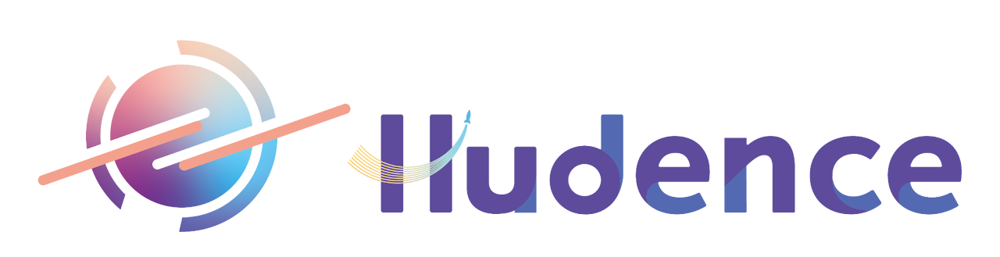

# Hudence 艾登星官網



## 專案簡介

這是 Hudence（艾登星）科技教育公司的官方網站，使用 Next.js 14 和 TypeScript 開發，具有現代化的設計和豐富的動畫效果。

### 🎯 網站亮點

- **專業教育內容**: 完整展示19+營隊類型、100+培訓教練、1000+受益學童的豐富實績
- **創新團隊展示**: 詳細介紹4個輔導創新創業團隊的專業領域和獲獎成果  
- **師資培訓體系**: 涵蓋陽明高中、台中科技大學、員林等多個培訓營的完整方案
- **智能化設計**: 路由感知導航、動態背景切換、多層級選單系統

## ✨ 特色功能

- 🎨 **現代化設計**: 使用 Tailwind CSS 打造美觀的用戶界面
- 🌊 **流暢動畫**: 基於 Framer Motion 的精美動畫效果
- 📱 **響應式設計**: 支援各種設備尺寸，提供最佳瀏覽體驗
- ⚡ **靜態網站**: 完全靜態化，適合部署到 GitHub Pages
- 🎯 **SEO 優化**: 完善的 meta 標籤和結構化數據
- 🔧 **TypeScript**: 提供完整的類型安全保護
- 🧭 **智能導航**: 路由感知的導航頭部，首頁與其他頁面自動切換背景色
- 📊 **豐富內容展示**: 詳細的營隊實績、團隊輔導成果和師資培訓數據
- 🎓 **教育專業化**: 專為科技教育機構設計的完整內容架構
- 🏆 **成果展示**: 多維度統計數據和視覺化成就展示

## 🚀 技術棧

- **Framework**: Next.js 14
- **Language**: TypeScript
- **Styling**: Tailwind CSS
- **Animation**: Framer Motion
- **Icons**: Lucide React
- **Deployment**: GitHub Pages

## 📋 網站結構

### 主要頁面區塊

1. **首頁 Hero**: 品牌介紹和主要價值主張
2. **關於我們**: 
   - 公司使命、價值觀和團隊介紹
   - 完整的成就統計數據展示
   - 委辦課程營隊詳細說明（19+營隊類型，1000+受益學童）
   - 輔導創新創業團隊實績（4+輔導團隊）
   - 師資培訓營完整方案（100+培訓教練）
3. **服務項目**: 六大核心服務領域
4. **課程介紹**: 分齡分級的課程內容
5. **學生作品**: 優秀學生作品展示
6. **最新消息**: 公司動態和新聞資訊
7. **聯絡我們**: 獨立聯絡頁面，包含聯絡資訊和諮詢表單

### 組件架構

```
app/
├── components/
│   ├── Header.tsx       # 智能導航頭部（路由感知背景色）
│   ├── Hero.tsx         # 首頁英雄區塊
│   ├── About.tsx        # 關於我們（大幅擴充）
│   │                    # - 團隊介紹與公司使命
│   │                    # - 委辦課程營隊（19+類型）
│   │                    # - 創新創業團隊輔導（4+團隊）
│   │                    # - 師資培訓營（100+教練）
│   ├── Services.tsx     # 服務項目
│   ├── Courses.tsx      # 課程介紹
│   ├── Portfolio.tsx    # 學生作品
│   ├── News.tsx         # 最新消息
│   ├── Contact.tsx      # 聯絡我們（首頁用）
│   └── Footer.tsx       # 頁尾
├── about/
│   └── page.tsx         # 關於我們頁面
├── contact/
│   └── page.tsx         # 獨立聯絡頁面
├── globals.css          # 全域樣式
├── layout.tsx           # 根佈局
└── page.tsx             # 主頁面
```

## 🛠️ 開發指南

### 環境要求

- Node.js 18 或更高版本
- npm 或 yarn

### 安裝與運行

1. **安裝依賴**

   ```bash
   npm install
   ```
2. **開發模式**

   ```bash
   npm run dev
   ```

   開啟 [http://localhost:3000](http://localhost:3000) 查看結果
3. **建置生產版本**

   ```bash
   npm run build
   ```
4. **導出靜態檔案**

   ```bash
   npm run export
   ```

### 部署到 GitHub Pages

本項目已配置自動部署到 GitHub Pages：

1. 推送代碼到 `main` 分支
2. GitHub Actions 會自動建置並部署
3. 網站將可在 `https://[username].github.io/Hudence` 訪問

## 🎨 設計系統

### 色彩配置

- **主色調**: 藍色系 (#0ea5e9)
- **次要色**: 紫色系 (#a855f7)
- **中性色**: 灰色系配色

### 動畫設計

- **進場動畫**: 淡入和上滑效果
- **懸停效果**: 縮放和陰影變化
- **背景動畫**: 流動的色彩球體

## 📱 響應式設計

網站支援以下斷點：

- **Desktop**: 1024px+
- **Tablet**: 768px - 1023px
- **Mobile**: 小於 768px

## 🔧 自定義配置

### 修改公司資訊

在各組件中更新以下內容：

- 公司名稱和 Logo
- 聯絡資訊
- 課程內容
- 服務項目

### 更新教育內容

在 `About.tsx` 中可自定義：

- **委辦課程營隊**: 新增營隊類型、合作機構、受益學童數據
- **創新創業團隊**: 添加新的輔導團隊資訊和成果展示
- **師資培訓營**: 更新培訓內容、合作院校、培訓教練數據
- **成就統計**: 修改各項統計數字和展示方式

### 導航系統配置

智能導航頭部支援：

- 路由感知背景色切換
- 首頁透明漸變效果
- 其他頁面品牌色背景
- 下拉選單多層級導航

### 添加新功能

1. 在 `app/components/` 中創建新組件
2. 在 `app/page.tsx` 中引入組件
3. 更新導航選單（如需要）
4. 新增路由頁面到對應目錄

## 📄 授權

本項目為 Hudence 艾登星科技教育有限公司所有。

## 📋 版本更新記錄

### v2.0 (最新) - 內容大幅擴充
- ✅ 完善團隊介紹內容，加入108課綱背景和教育使命
- ✅ 豐富委辦課程營隊說明（19+營隊類型，6個具體案例）
- ✅ 擴充創新創業團隊展示（4個輔導團隊詳細資訊）
- ✅ 完善師資培訓營內容（3個培訓營實績，100+培訓教練）
- ✅ 創建獨立聯絡頁面，優化用戶體驗
- ✅ 實現智能導航系統，路由感知背景切換
- ✅ 增加豐富的視覺效果和統計數據展示

### v1.0 - 基礎版本
- 基本網站架構建立
- 核心組件開發完成
- 響應式設計實現

## 🤝 貢獻

歡迎提交 Issue 和 Pull Request 來改善這個項目。

---

**© 2024 Hudence 艾登星科技教育有限公司**
